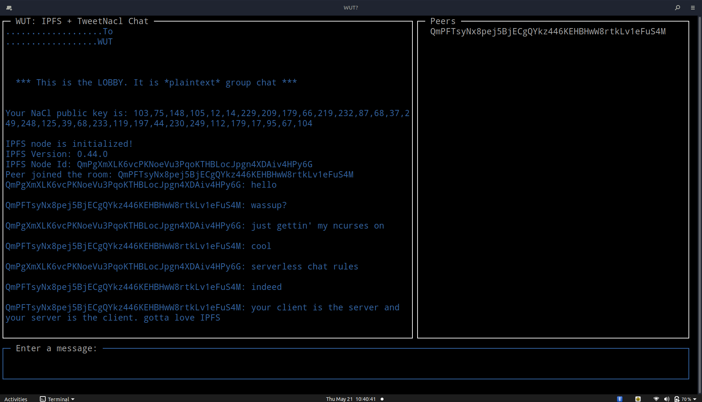

# ¿wut?

Serverless, IPFS, Tweetnacl-js-based chat application for terminal in an `ncurses` style

## Goals

* [x] `Major issue`: Make pubsub work outside local networks: Works now via webrtc-star server as bootstrap node
* [x] Serverless 'lobby' chat multiple participants
* [x] Serverless E2E encrypted chat for 2 participants (at first)
* [x] As nerdy as possbile, hence the `ncurses` style
* [ ] Tab-completion of peer names, commands
* [ ] Tab / arrows to focus UI elements
* [ ] Social Proofs, see: https://github.com/IBM/ipfs-social-proof
* [ ] Child_process for IPFS, workers for crypto? Discuss.
* [ ] Tests
* [ ] DMs List UI
* [ ] Paste screenshots into chat
* [ ] Keys / keychain persistence
* [ ] Key stretching / BIP-39 password for keychain, configuration data.
* [ ] Keybase-style UI layout
* [ ] Encrypted file sharing via tweetnacl-js & IPFS file storage
* [ ] SES-based plugins, (See: Secure ECMAScript https://github.com/Agoric/SES-shim )
* [ ] Group encrypted chat
* [ ] Emojis
* [ ] Encrypted message persistence in IPFS via OrbitDB, js-threads?

## Install

Requirements: node 12, yarn

`npm install -g yarn`

`git clone git@github.com:daviddahl/wut.git`

`cd wut`

`yarn install`

`node main.js`

## Testing

`yarn test`
