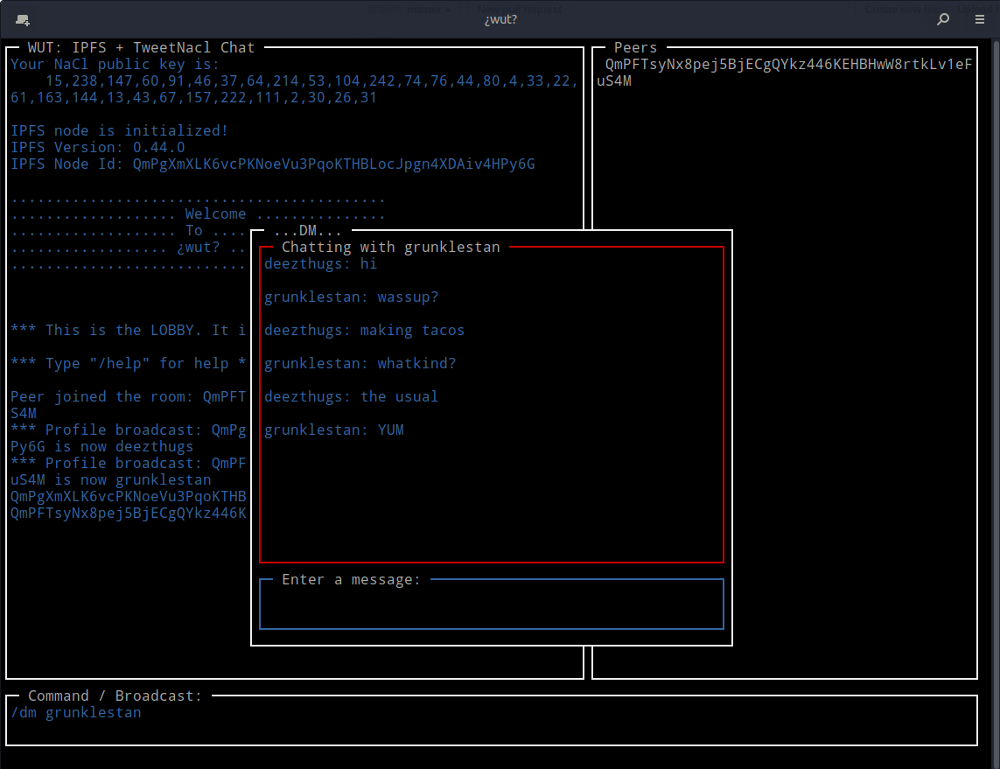

# wut

IPFS-based chat

## Goals

* Serverless 'lobby' chat multiple participants
* Serverless E2E encrypted chat for 2 participants (at first)
* As nerdy as possbile, hence the `ncurses` style

## Install

Requirements: node 12+

`git clone git@github.com:daviddahl/wut.git`

`cd wut`

`npm install`

`node main.js`
